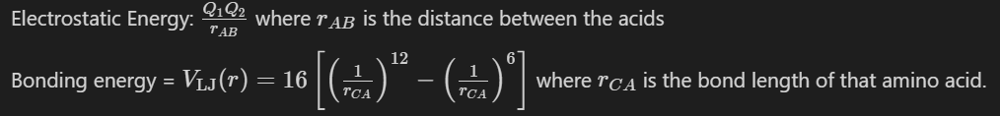

# Vision

The aim of this hackathon is to come up with algorithms to solve problems in biology and bio-computation. The organizers feel that programming is in everyone's blood, for we are inherently algorithmic. Hence, the questions do **not** expect that you know some fancy set of functions to solve these problems. They just need you to think about how you would go about doing something.

Most of the questions are **not** inherently biological in nature. Biology however does provide motivation to solve these problems. The organizers feel that these questions do not need any particular knowledge of Biology (partly because the organizers themselves are not great fans of Biology 👅). Theory and necessary references are linked with the questions.
Feel free to call the volunteers if you need additional information.

# [Click here for Rules](./rules)

# [Click here for Submissions](./results)

# Questions

To celebrate Darwin week, you decided to go on an expedition to the Galapagos island. You and your friends book a cruise for the same. Upon boarding the ship you come to know that the cruise has all sorts of researchers and science enthusiasts who are going to Galapagos and nearby islands to conduct different experiments in honour of Darwin. The journey is going great while all of a sudden you seem to notice an island close by that is not shown on the map. The captain agrees to halt on the seemingly new island and you dock there. As soon as everyone sets foot on the island they are fascinated by things that seem out of the ordinary. The island was previously undiscovered and thus there lies a great bounty of flora and fauna and also some traces of extinct species that have not been found anywhere else. The ship was loaded with scientists and equipments for the experiments.

## Question 1 [20 Marks]

One of the first things that you find out there is a preserved bone of a creature that looks like an archaic flying dinosaur.
One of the molecular evolution scientist Dr. Dwight want to extract DNA from the bone and sequence it.
As you and your friends are mere students and beginners you need to prove your worth before you are allowed to help the researchers in their experiments:
Dr. Dwight gives you a simple task:

Dr. Dwight provides you with a simple [FASTA](https://en.wikipedia.org/wiki/FASTA_format) file and asks you to find the most frequently occurring k-mer in all the sequences.
A k-mer is a small subsequence of length k from the larger piece of DNA/RNA/Protein.
Given a fasta file and a value of k, you need to accomplish the following:

- Extract all the sequences from the given file
- Find the most frequently occurring k-mer in all of the sequences combined (one k-mer for the whole file)

### Input

`k` and FASTA file of one organism.

Take k=5 and [this](seq.fasta) fasta file

### Output

1. All kmers, split by `,`
2. Most occuring kmers

## Question 2 [35 Marks]

A little while later you stumble upon a population of wild rabbits of different colour that fascinates Dr. Michael, the population geneticist. He is fascinated by the colours ranging from blue to red. He has a task in mind but as with Dr. Dwight, he doubts whether you can solve the task, so he wants to test you on your knowledge of Mendel's Laws and probability. He asks the following question:

Suppose we have a single ancestor with the genotype AaBb in the 0th generation. The ancestor mates with another individual with genotype AaBb to produce offsprings. In the first generation the ancestor has 2 children. At each generation, a successor organism mates with a foreign individual with genotype AaBb to produce 2 children.

Given two positive integers k and N, return the probability that at least N AaBb organisms will belong to the k-th generation of the family tree (don't count the AaBb foreign mates at each level).

Assume Mendel's second law (independent assortment) holds for the factors. (You can try out simulating the family tree for a challenge or apply biology knowledge from your core years and basic probability to come up with a simpler solution!)

Please don't hesitate to reach out to find out how genetics works.

### Output

The probability.

## Question 3 [25 Marks]

After submitting a satisfactory program that can calculate the probabilities as mentioned in the question, Dr. Michael tells you about the original task that he had in his mind:

Dr. Michael with his advanced genotype detector, has detected the genotypes of a few of the colorful rabbits for a locus that he presumes determines the colour of the rabbits. Using this knowledge he has planned out a breeding experiment with several pedigree trees depicting the mating lines.

The experiment is as follows. First, $$2^N$$ individuals with known genotypes are grouped into $$2^{N-1}$$ groups of 2. Each group has one progeny. This is repeated. Thus every generation, the number of individuals reduce by a factor of 2. At the end of N generations, one individual remains.

Dr. Micheal wants you to write a program which is able to predict the probability of the last individual of this epic lineage to be `CC` `cc` and `cC/Cc`.

### Input

Input will be $$N$$ and a list of $$2^N$$ initial individual genotypes. Groups are to be made with consecutive members.

### Output

3 numbers displaying the probabilities of last individual being `CC` `cc` and `cC/Cc`.

### Example

```
[IN:1] 2
[IN:2] cc cc cc cc
[OUT ] 0 1 0
```

## Question 4 [50 Marks]

Meanwhile Dr. Jim, the ecologist was sitting silent. You and your friends approached him to know what he was thinking about deeply. He said he was wondering about the patterns of flight of the extinct dinosaur (the bone they had found earlier). He smiles and asks you if you can model a flight simulation given certain well-thought constraints about the movements of the creatures.

Dr. Jim tells that the individual creatures ("let's call them Aveosaurs") are inverted triangular 2D creatures (for the 2D simulation). Each Aveosaur has an internal state (position, velocity, mass) and an external state (knowledge about flock members within a certain radius in their neighborhood). The Aveosaurs have 3 main behaviors (forces that act on it):

- Separation: Each Aveosaur considers its distance to nearby flock mates and applies a repulsive force in the opposite direction to the nearest neighbor, scaled by the inverse of the distance.
- Cohesion: Each Aveosaur moves in the direction of the average position of its neighbors.
- Alignment: Each Aveosaur aligns its direction to the average direction of its nearest neighbors within a provided radius.

At each time step, each Aveosaur follows the above three rules, calculates it position and moves to it. Run a visual simulation and if possible save the output sequence as a series of images/video file so that Dr. Jim can analyse the group behavior patterns.

### Values

- Assume the sky is 1200m X 800m
- Each time step is 1 second (though this doesn't matter)
- Mass of Aveosaurs - should be randomly selected for each individual (varies from 50 to 250 kgs)
- Initiate positions randomly
- Initiate velocities (as 2D vectors) with magnitudes randomly selected between -9 to 9 mps
- radius of knowledge - 80m
- begin with 100 creatures
- leave out the constants (for force laws) as settable
- Plot it in such a way that we can see the direction of the Aveosaur
- Assume periodic boundary conditions. Basically, birds which fly out of the left fly back in from the right, etc.

## Question 5 [50 Marks]

Everyone is finally exhausted and ready to go, when suddenly Dr. Dwight appears in front of your group and tells you that he has found some interesting amino acid combinations in the protein translations of the DNA sample collected from the Aveosaur bone. He has one final task for you but it is a simple computational task that can be solved on your laptop in the cruise while you are on your way to Galapagos. You listen as he closely explains the final puzzle of the most interesting day you had in your life:

There is a central C atom and 4 amino acids bound to it in one of the proteins (as shown below). You must write a program that outputs the positions (in a 3D space) of the Amino acids with the C on the origin.

```
    Ai
Aj  C  Ak
    Al
```

You are given the following information:

Charges on the amino acid.

| Amino Acid | Charge |
| ---------- | ------ |
| A1         | 0.848  |
| A2         | 0.975  |
| A3         | 1.185  |
| A4         | 0.848  |
| A5         | 1.133  |
| A6         | 1.137  |



### Input

The four amino acids

### Outputs

The positions of the amino acids

### Hint

Look at previous hackathons. Maybe something can help???

- [DWH 2020](../2020)
- [CTM S-Week 2020](https://iiserm.github.io/schrodinger-week/code-the-matrix)

# Done!

After you solve the final question - you arrive at Galapagos to enjoy the rest of the evening with your friends, but not before-

- Renaming all your files as `Qx.ext`
- Putting them into a zip/tar file with name `teamname.zip`/`teamname.tar`
- Mailing them to turingclub@iisermohali.ac.in
- Saying thank you to Arpit Omprakash for these lovely questions

# Enjoy!

Good Luck!

