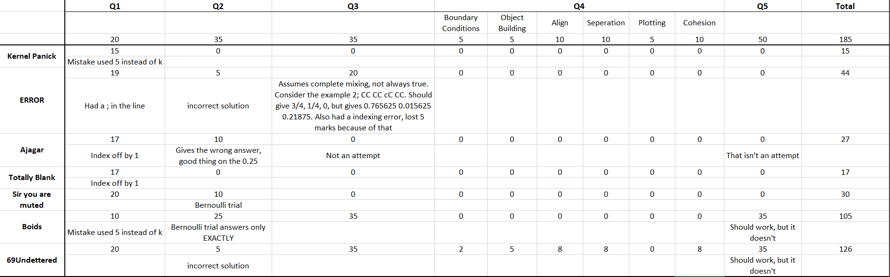

# Results

# Solutions

The answers that Arpit has made can be found in [this repository](https://github.com/aceking007/DWH2021).
The below is a very short analysis of what people did. I would really like to add a proper discussion of solutions, but due to lack of time I've not been able to do it.
I'd really appreciate it if some of you can extend the discussion by sending PRs.

## Q1. FASTA

Eh easy everyone did it. Nonetheless, see my solution [here](kmer.jl)

## Q2. AaBb

Boids got it NEARLY right; just had to sum over all n>N-1, but theirs was a baysian simulation. Maybe we can make a deterministic version?

## Q3. CC Cc cc

Boids and 69Undettered got it right.

## Q4. Boids

69Undettered got it nearly right, just needed a little more time to fix it up. I still believe that functional programming would have been cleaner, but ok. I'd really like 69Undettered to clean up the code, comment it and put up the complete code on GitHub eventually.

## Q5. Protein

Boids and 69Undettered tried to do gradient descent, albiet 69Undettered's version was _marginally_ cleaner, but just messy on the whole. Both didn't work though, not sure why. But a few groups were looking at Newton-Mead and a multitude of other deterministic algorithms. These models are great for optimization of low variable things. They are very fast and very accurate. But if it has too many variables, these methods start becoming caught up in local minimas. There are other very sophesticated algorithms which do their jobs well, but for high degree of freedom conditions, Monte Carlo simulations are the preferred choice of methods. See the example in Code The Matrix Q2.

# Submission

See all submissions [here](./submissions)
